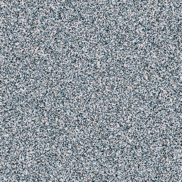

# PROJECT UMBRA: Neural-Cryptographic LPI Datalink

**Project Umbra** is a proof-of-concept for **Low Probability of Intercept (LPI)** communications. It utilizes a neural codec to modulate high-fidelity imagery into standard audio `.wav` files that are statistically indistinguishable from random white noise.

> *"Hiding the content is cryptography. Hiding the existence of the message is steganography."*

---

## 🛡️ Objectives & Performance

The primary goal was to transmit HD images through a "hostile" audio channel (static) without the signal being recognized as structured data.

| Metric | Performance | Notes |
| :--- | :--- | :--- |
| **Fidelity** | **>40dB PSNR** | Visually lossless reconstruction on unseen datasets. |
| **Stealth** | **Gaussian Statistical Match** | Carrier signal mimics standard PCM audio static. |
| **Security** | **31dB Margin** | Unauthorized decryption attempts yield pure entropy (<10dB PSNR). |

### Visual Verification
*Demonstration of the "God Gene" seed sensitivity.*

| Original Input | Authorized Decryption | Unauthorized Attack |
| :---: | :---: | :---: |
|  |  |  |
| *Source Signal* | *Correct Seed (God Gene)* | *Incorrect Seed (Wrong Key)* |

---

## 🛠️ Methodology: The "God Gene"

Umbra moves away from traditional LSB (Least Significant Bit) steganography, which is fragile, and instead uses **Generative AI Signal Reconstruction**.

### 1. Chaos-Modulated Encoding
The source image is not simply hidden; it is transmuted. The pixel data is flattened and subjected to a chaotic permutation layer defined by a cryptographic seed. This spreads the image energy across the entire frequency spectrum, effectively "bleaching" the structural information into noise.

### 2. Evolutionary Optimization
The decoder does not use standard error correction. Instead, it utilizes a **Neural Denoising Autoencoder** tuned via Evolutionary Algorithms. Over **200+ generations**, a genetic algorithm hunted for a specific set of hyperparameters (dubbed **The God Gene**) that allows the AI to "hallucinate" the original image back into existence *only* when the noise pattern aligns with the authorized key.

### 3. The Audio Bridge
The resulting data stream is normalized and encapsulated into a **16-bit PCM WAV** container. To a spectral analyzer or human ear, the file appears to be a recording of thermal noise.

---

## 💻 Installation & Usage

No Python installation avalable yet.
1. Download the latest `Umbra_Terminal.exe` from the **[Releases Page](../../releases)**.
2. Run the executable.
