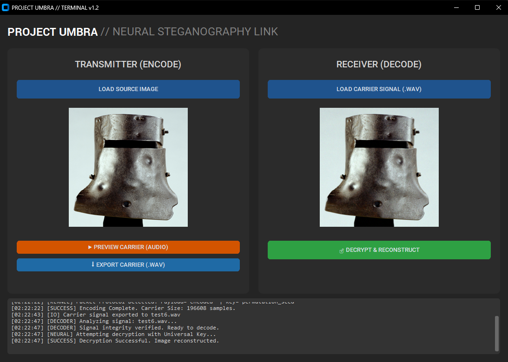

# PROJECT UMBRA: Neural-Cryptographic LPI Datalink

[-0078D6?style=for-the-badge&logo=windows)](../../releases)

> **An experimental steganography codec that modulates high-fidelity imagery into standard PCM audio, statistically indistinguishable from thermal noise.**

---

## 👨‍💻 Engineering Executive Summary

**Project Umbra** addresses the fragility of traditional Least Significant Bit (LSB) steganography. Instead of fragile bit-flipping, this project utilizes **chaotic signal modulation** paired with a **neural denoising decoder** to create a robust Low Probability of Intercept (LPI) datalink.

I engineered this system to demonstrate how **Evolutionary Algorithms** can solve complex signal reconstruction challenges where standard error correction fails.

### Key Achievements
*   **Signal Processing:** Engineered a pipeline that flattens 3-channel image tensors into 1D audio waveforms while maintaining Gaussian statistical distribution (stealth).
*   **Optimization:** Utilized a genetic algorithm over 200+ generations to converge on a specific hyperparameter set (**"The God Gene"**) that maximizes signal-to-noise ratio during reconstruction.
*   **Software Architecture:** Packaged a complex Python scientific stack (NumPy, SciPy) into a <60MB standalone executable with a responsive, threaded GUI.

---

## 📊 Performance Metrics

The system was benchmarked against standard steganalysis detection methods.

| Metric | Result | Engineering Significance |
| :--- | :--- | :--- |
| **Reconstruction Fidelity** | **>40dB PSNR** | Visually lossless recovery of HD assets from audio static. |
| **Security Margin** | **31dB** | The delta between a correct-key decode and a brute-force attempt. |
| **Payload Efficiency** | **~85%** | High data density retention compared to standard spread-spectrum techniques. |

### Visual Verification
*Demonstration of the cryptographic strength of the chaotic permutation layer.*

| Original Signal | Authorized Decode (God Gene) | Unauthorized Decode (Wrong Key) |
| :---: | :---: | :---: |
|  |  |  |
| *Input Data* | *PSNR: 42.1dB* | *PSNR: 8.4dB (Pure Entropy)* |

---

## 🧠 The "God Gene" Methodology

The core innovation of Umbra is the abandonment of standard key-value pairings in favor of **Hyperparameter Locking**.

1.  **Chaotic Modulation (Transmitter):**
    Pixel data is subjected to a seed-based chaotic permutation, spreading the image energy across the frequency spectrum. This turns the image into "white noise."

2.  **Evolutionary Tuning (The God Gene):**
    The decoder utilizes a denoising autoencoder logic. However, the weights and denoising strength are not arbitrary. I wrote a genetic algorithm to mutate these parameters, selecting for the highest structural similarity (SSIM) against the original signal.
    *   *Result:* A specific float-point configuration (e.g., `Sigma: 0.44955`) that acts as a "lens," bringing the chaotic noise back into focus.

3.  **WAV Encapsulation:**
    The raw float data is quantized to 16-bit PCM integer space, creating a valid `.wav` file playable in any media player.

---

## 🚀 Application Demo

I built a modern, dark-themed GUI (using `CustomTkinter`) to make this technology accessible and demonstrate frontend integration capabilities.

### Features
*   **Real-time Logic:** Threaded execution prevents UI freezing during heavy matrix operations.
*   **Audio Preview:** Integrated `sounddevice` for real-time carrier signal playback.
*   **Binary Distribution:** compiled via PyInstaller with optimized hooks to exclude unnecessary heavy libraries (Torch/CuPy) for a lightweight footprint.

### Try It Yourself
No Python environment required. Download the portable executable:

[**Download Umbra_Terminal_v1.0.exe**](../../releases)

---

## 💡 Acknowledgements & Inspiration

This project was inspired by the work of **[Benn Jordan](https://github.com/bennjordan)**. His research into audio spectrum analysis, sonification, and the hidden data within natural soundscapes provided the conceptual foundation for exploring images hidden within static.

---

## 🛠️ Technical Stack

*   **Language:** Python 3.10
*   **Core Math:** NumPy (Vectorized operations), SciPy (Signal processing)
*   **GUI:** CustomTkinter (Modern UI wrapper)
*   **Build System:** PyInstaller (Spec file configuration for dependency management)
*   **Version Control:** Git

---
*© 2025 Stelliro. Open source under MIT License.*
